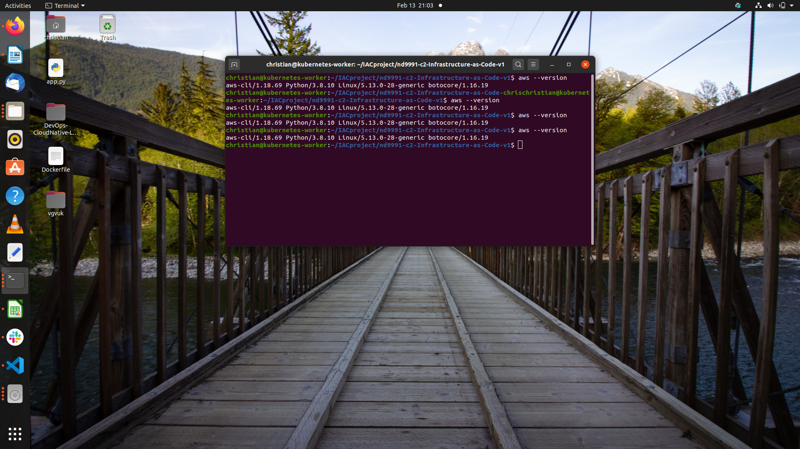

# UdaGramDeployingIAC
My company is creating an Instagram clone called Udagram.  Developers want to deploy a new application to the AWS infrastructure.  I have been tasked with provisioning the required infrastructure and deploying a dummy application, along with the necessary supporting software.  This needs to be automated so that the infrastructure can be discarded as soon as the testing team finishes their tests and gathers their results. 

### Dependencies
##### 1. AWS account
I require to have an AWS account to be able to build cloud infrastructure.

##### 2. VS code editor
An editor would be helpful to visualize the image as well as code. 

##### 3. An account on www.lucidchart.com
A free user-account on [www.lucidchart.com](www.lucidchart.com) is required to be able to draw the web app architecture diagrams for AWS.

# Ensure that the AWS CLI is configured before runniing the command below

# Create the network infrastructure

# Check the region in the create.sh file
./create.sh UdaGramApp network.yml network-parameters.json

# Create servers

# Change the AMI ID and key-pair name in the servers.yml

# Check the region in the update.sh file
./update.sh mySecStack servers.yml server-parameters.json
`
json

``

